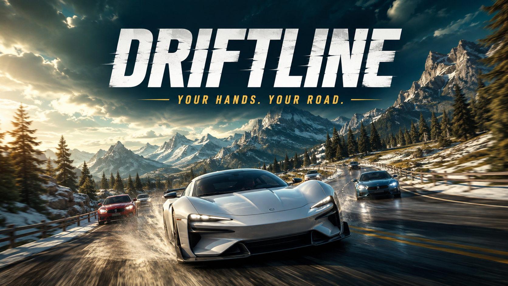
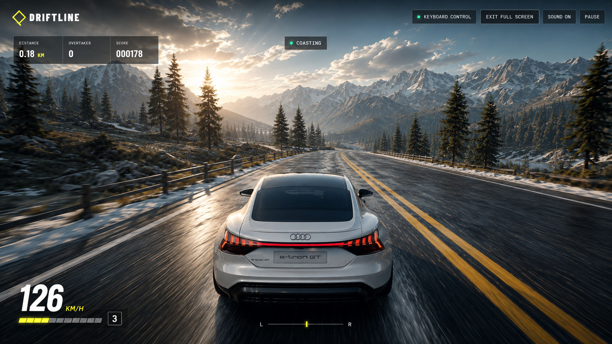
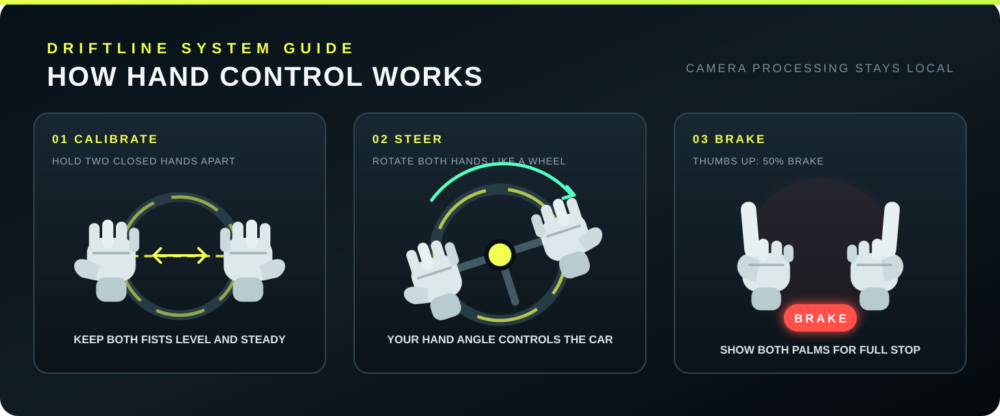

# Driftline



A stylized endless-driving game controlled by a two-hand virtual steering wheel. The browser tracks two closed hands locally, converts their angle into steering, and automatically manages acceleration and braking for curves and traffic.

## Gameplay



## Run locally

```bash
npm install
npm run dev
```

Open the local URL shown by Vite in Chrome or Edge. Camera access works on `localhost` or an HTTPS deployment.

## Deploy to GitHub Pages

Push the project to a repository named `car_driving` using the `main` branch. In **Settings → Pages**, select **GitHub Actions** as the deployment source. The included workflow tests and deploys the game automatically to:

```text
https://<your-github-username>.github.io/car_driving/
```

## Available car models

Choose any of these vehicles directly on the start screen. Traffic reuses the same model collection with randomized realistic paint colors.

| Vehicle                          | Driver car | Traffic car |
| -------------------------------- | :--------: | :---------: |
| 2017 Ford F-150 Raptor (default) |    Yes     |     Yes     |
| 2023 Ford Everest Sport          |    Yes     |     Yes     |
| Hyundai Ioniq 5                  |    Yes     |     Yes     |
| 2018 Audi e-tron GT Concept      |    Yes     |     Yes     |

You can select 0, 4, 8, 12, or 16 traffic cars and choose how many different models appear. Car variety defaults to 1, which reuses the selected driver model for traffic and reduces model parsing and memory use. Higher traffic counts or model variety may reduce frame rates on lower-powered devices.

On the first visit, a setup popup keeps the game locked while it downloads approximately 20 MB of core scenery and road textures with live progress. Only selected car models are downloaded afterward; each model is stored on first use and reused on later visits. Interrupted core downloads can be retried and resume from files that are already cached.

## Controls



- **Hand mode:** hold two closed hands apart, keep them level during calibration, and rotate them like a steering wheel. Raise both thumbs for 50% braking or show both open palms for a full stop.
- **Keyboard mode:** use `W` or up arrow to accelerate, `S` or down arrow to brake, and `A` / `D` or left / right arrows to steer. Braking stops at zero; there is no reverse gear.
- **Pause:** use the Pause button or press `Escape`.
- **Performance diagnostics:** press `F3` to toggle the performance HUD. Add `?perf=1` to the URL to open it automatically.
- **Graphics:** open Graphics in the top bar to choose Auto, Low, Medium, or High quality. The selected preset is saved locally.

Hand-control mode accelerates automatically. Keyboard mode uses manual acceleration and braking. Traffic and curve assists can slow the car in either mode. Drive on the left with same-direction traffic; the right lane carries oncoming vehicles and can be used carefully for overtaking.

## Architecture

The runtime is organized by responsibility:

- `src/app` coordinates menus, input mode, asset readiness, and game lifecycle.
- `src/game/simulation` contains deterministic gameplay rules that can be tested without WebGL.
- `src/game/world` owns reusable Three.js scene systems and their GPU-resource lifecycle.
- `src/ui` renders the static shell, startup gate, and HUD.
- `src/audio` owns the procedural Web Audio graph.
- `src/controls` contains keyboard and hand-tracking input adapters.
- `src/diagnostics` contains opt-in runtime measurements that stay disabled during normal play.

Keep game rules deterministic by passing state in and returning results. DOM and Three.js mutations should stay at the edges, and every scene system that allocates GPU resources should expose `dispose()`.

## Checks

```bash
npm test
npm run build
```

The MediaPipe runtime and hand model are copied into `public/mediapipe` during `npm install`, so camera processing happens on the device without uploading video.

## License

Original Driftline source code and documentation are available under the [Driftline Non-Commercial License](LICENSE). Commercial or for-profit use is prohibited without prior written permission. Third-party assets retain their respective licenses and attribution requirements.

## 3D asset credits

- [2017 Ford F-150 Raptor](https://sketchfab.com/3d-models/2017-ford-f-150-raptor-2be278ef4dc94d9fa00fae8b33da8273) by [Ddiaz Design](https://sketchfab.com/ddiaz-design), licensed under [CC BY-NC-SA 4.0](http://creativecommons.org/licenses/by-nc-sa/4.0/).
- [2023 Ford Everest Sport](https://sketchfab.com/3d-models/ford-everest-sport-2023-c37bec0353a94f90a3acbe09ceb3aecf) by [Asadawut.Kaewma](https://sketchfab.com/Asadawut.Kaewma), licensed under [CC BY 4.0](http://creativecommons.org/licenses/by/4.0/).
- [Hyundai Ioniq 5](https://sketchfab.com/3d-models/hyundai-ioniq-5-lowpoly-675e78311e8440d88714bd212cb7a8fb) by [andikapratamaw](https://sketchfab.com/andikapratamaw), licensed under [CC BY 4.0](http://creativecommons.org/licenses/by/4.0/).
- [2018 Audi e-tron GT Concept](https://sketchfab.com/3d-models/2018-audi-e-tron-gt-concept-e35726151c9e4a169c005d54509715fa) by [Ddiaz Design](https://sketchfab.com/ddiaz-design), licensed under [CC BY-NC-SA 4.0](http://creativecommons.org/licenses/by-nc-sa/4.0/).
- [Pine Tree](https://sketchfab.com/3d-models/pine-tree-d45218a3fab349e5b1de040f29e7b6f9) by [evolveduk](https://sketchfab.com/evolveduk), licensed under [CC BY 4.0](http://creativecommons.org/licenses/by/4.0/).

Attribution and license metadata are also embedded in each GLB file.
